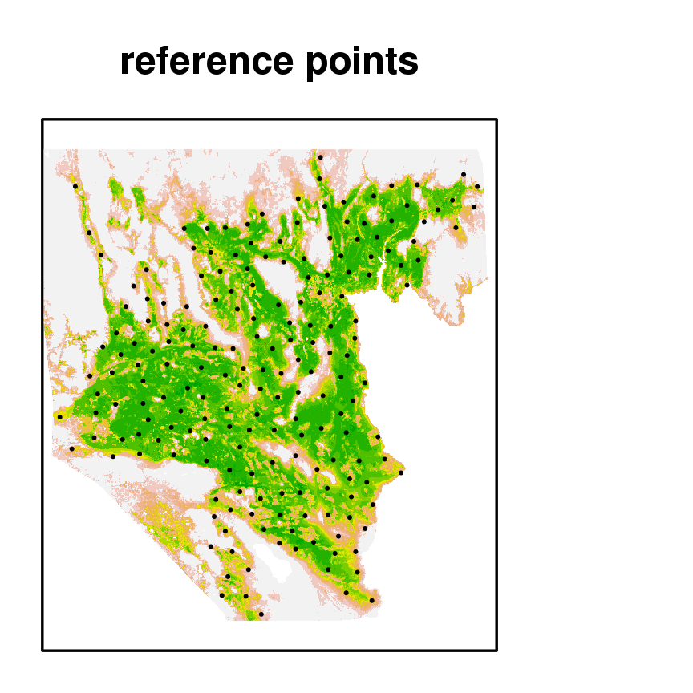
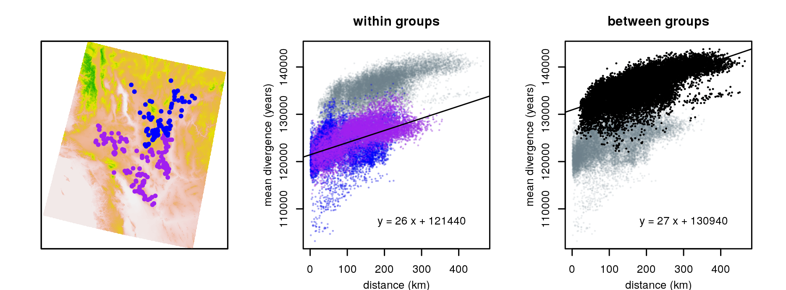

Methods and Results
===================

Methods
=======

Estimation of pairwise sequence divergence
------------------------------------------

Conversion of sequence divergence to time since most recent common ancestor
---------------------------------------------------------------------------

The mean sequence divergence between two sequences
provides an estimate of the mean time since most recent common ancestor between the sequences,
averaged across the sequence,
and multiplied by twice the substitution rate [Hudson].
To make our results more interpretable,
for the purposes of fitting models we converted sequence divergences to years
by dividing by an estimate of twice the substitution rate.
WE GOT THIS ESTIMATE FROM XXX.
This estimate is probably not very close to the true mean substitution rate,
but is at least within an order of magnitude,
and so gives a rough idea of the time scales involved.

Motivation 
----------

The current state-of-the-art method for making predictions of gene flow on continuous landscapes
is to compute the so-called *resistance distances* [McRae?].
The nomenclature and formalism derives from a mathematical correspondence between electrical networks
and certain quantities of reversible random walks:
it turns out that if we equate the movement rates of a random walk between nodes in a network
with the conductances of wires connecting those nodes,
then the *effective resistance* between two points of the network
(what one would measure using a volt meter)
is equal to the *mean commute time* for the random walk,
i.e. the mean time until a random walker, begun at one of the points,
first returns to its starting point, after having visited the other point [CITE].
This correspondence, usually stated for discrete networks,
carries over to continuous models,
where the random walk is replaced by its continuous counterpart,
a diffusion process whose movement rates depends on local properties of the inhomogeneous medium.
The resistance distance is then a powerful summary of gene flow across the landscape,
since it integrates movement along all possible paths between the two locations.

The resistance distance has been shown to be a useful summary, 
but we would like to extract concrete predictions from it,
so need to think more explicitly about what it means.
Each generation since the most recent common ancestor provides an opportunity
for mutations to occur that are inherited by only one of the sequences,
and so mean sequence divergence provides an estimate of the mutation rate multiplied by 
the average time since the most recent common ancestor, across the genome [Hudson].
Fixing a particular point on the genome, the time since the most recent common ancestor of two sequences
can be found by following the lineages along which that bit of genome was inherited,
until they meet in the most recent common ancestor.
Following a lineage backwards in this way can be seen as a random walk:
the probability the lineage moves from location $x$ to location $y$ in a generation
is the probability that a tortoise living at $x$ has inherited the relevant bit of genome from a parent living at $y$.
For markers that are not sex-linked, this means moving to the location of a randomly chosen parent.
Intuitively, 
the motion of a lineage backwards in time
looks like a random walk that is determined by the dispersal patterns of young tortoises,
except that lineages are more likely to move towards better habitat,
since more offspring are produced in such places.
It is known that under reasonable population models
-- in particular, those that show significant patterns of isolation by distance -- 
the motions of two nearby lineages are not independent [Barton, Depaulis, Etheridge].
However, it is reasonable to assume that the motion of distance lineages is independent.
Then, we can decompose the time to most recent common ancestor into two parts:
the time until two lineages are close to each other,
and the time until they find a common ancestor, given that they are close.
This first part determines how sequence divergence decreases with distance,
while the second part determines typical divergences between nearby individuals.

To relate this to resistance distance, 
we approximate the mean time until two lineages are close to each other
by the average commute time:
specifically, we approximate the mean time until the lineages of tortoises at locations $x$ and $y$ are within distance $d$ of each other
by one-half the sum of the mean time that a random walk begun at $x$ takes to get within distance $d$ of $y$,
and the same quantity exchanging $x$ and $y$.
If the landscape is homogeneous then this approximation is exact:
the displacement between two independent walks is itself a walk that moves at twice the speed.
On an inhomogeneous landscape it is a reasonable approximation,
except in extreme circumstances.

Model specification
-------------------

A model of landscape resistance, as discussed above,
is essentially a specification of a reversible random walk on the landscape.
A reversible random walk is specified by two quantities:
the *stationary distribution* of each point $x$, denoted $\pi(x)$,
and the *relative jump rates* between each pair of adjacent locations $x$ and $y$, denoted $j(x,y)$;
these combine to give the total rate of movement from $x$ to $y$ as $G(x,y) = j(x,y)/\pi(x)$.
The requirement that the random walk to be reversible, i.e. $\pi(x) G(x,y) = \pi(y) G(x,y)$,
means that relative jump rates must be symmetric, i.e. $j(x,y) = j(y,x)$.

We then allow these two ingredients to be determined by linear functions of the landscape layers: 
if we have $n$ landscape layers whose values at location $x$ are $L_1(x)$, ..., $L_n(x)$,
then we suppose that
$$
    G(x,y) = \beta \times \frac{1}{1 + \exp( - \gamma_1 L_1(x) - \cdots - \gamma_n L_n(x) )} \times \frac{1}{1 + \exp( - \delta (L_1(x)+L_1(y)) - \cdots - \delta (L_n(x)+L_n(y)) )} .
$$
The parameters are: $\beta$, an overall scaling factor, and for each $1 \le k \le n$,
$\gamma_k$, that determines how the $k$th layer affects the stationary distribution,
and $\delta_k$, that determines how the $k$th layer affects the relative jump rates.

In practice, then, a model is determined by:

1. A *mask*, i.e. a specification of the total potential habitat area available for movement;
   movement rates to locations outside of this are assumed to be zero.

2. The *layers*, which provide a numerical value for each location on the landscape;
   we include a "constant" layer (that takes the value 1 everywhere),
   and normalize remaining layers to have mean zero and variance 1.

3. The *parameters* $\beta$, $\gamma_1$, ..., $\gamma_n$, and $\delta_1$, ..., $\delta_n$.

4. A *neighborhood size* $R$ and a *local coalescence time* $T$.

These are combined to fit the data by computing for each $x$ and $y$ the mean time until a random walk begun at $x$
first gets closer than $R$ to the location $y$, which we denote by $h_R(x,y)$,
and postulating that the observed sequence divergence between tortoises at locations $x$ and $y$,
denoted $d(x,y)$, is equal to $T$ plus the mean $R$-commute time, i.e.
$$
d(x,y) =  T + (h_R(x,y) + h_R(y,x))/2 + \epsilon,
$$
where $\epsilon$ is the noise due to demographic stochasticity and sequencing error.

Fitting procedure
-----------------

To fit the model above,
we find parameters to minimize the weighted mean squared error
$$
   L = \sum_{x,y} ( d(x,y) - T - (h_R(x,y) + h_R(y,x)) )^2 .
$$
This requires computing the times $h_R(x,y)$,
which can be done as follows.
First, we compute the movement rates of the random walk
and place them in a matrix $G$, with rows and columns indexed by locations,
and whose $(x,y)$th entry is $G_{x,y}$ defined above.
Fix a location $y$ and a distance $R$, 
let $N_R(y)$ be the set of locations within distance $R$ of location $y$.
Then the times $h_R(x,y)$ solve the equations
$$
    \sum_z G_{x,z} h_R(z,y) = - 1 \qquad \text{for} \; x \notin N_R(y) ,
$$
and boundary conditions
$$
    h_R(x,y) = 0 \qquad \text{if}\; x \in N_R(y) .
$$
This forms one system of equations for each $y$,
that we solve numerically
using sparse matrix solvers in the *Matrix* package in *R* [Maechler].

Analytically, the solution can be written as follows:
for a given $y$ and $R$ let $\tilde G^(y,R)$ denote the matrix obtained by removing the rows and columns of $G$ corresponding to $N_R(y)$.
Then, seen as a vector indexed by $x$,
$$
    h_R(x,y) = (\tilde G^{y,R})^{-1} (-1),
$$
where $(\tilde G^{y,R})^{-1}$ is the matrix inverce of $\tilde G^{y,R}$, and $(-1)$ denotes the vector whose entries are all $-1$.
This can be substituted into the expression for the mean squared error above,
and then differentiated,
to find analytic expressions for the gradient vector and Hesisan matrix of $L$
with respect to $T$, $\beta$, each $\gamma$, and each $\delta$.
With these hand, we then use a "trust region" optimization routine, as coded in the package *trust* in *R* [Geyer].
This allows us to find best-fitting choices of all parameters except $R$;
in practice, we then fix $R$ at 15km.
It would be preferrable to also optimize over $R$;
however, $R$ is nearly confounded with $T$, in that increasing $R$ is very nearly equivalent to adding a constant to $h_R(x,y)$,
and so this choice does not significantly affect results.

Landscape resistance models
---------------------------

The tortoise habitat model of [Nussear et al] fit a maxent model using XX landscape variables,
of which the most important were elevation (XX%) and annual growth potential (AGP; XX%).
Therefore, we used the above procedure to fit a large number of landscape models,
varying which landscape layers were used,
which tortoises were used to fit the model,
and which habitat mask was used.
In all cases, we masked regions to the east of the Colorado river.

Each model fitting procedure produced a set of parameters,
which we evaluated in a common framework using all tortoises,
and evaluating model fit using *weighted median residuals*.
We use median, rather than mean-squared, residuals, to reduce the effect of outliers,
and we weight these so that the measure of goodness of fit assigns each weights to each geographic area
(unweighted would significantly upweight locations with more samples).
Furthermore, we only use comparisons *within* each of the two major regions,
because, as argued above (XXX), 
the relationship between the two regions is not likely to be a product of tortoise movement as captured by this model.
Concretely:
for the $i$th sampled tortoise, let $n_i$ be the number of other sampled tortoises within 25km,
and let the $(i,j)$th *weight* be
$$
    w_{i,j} = 1/(n_i n_j) \qquad \text{if $i$ and $j$ are in the same region},
$$
and $w_{i,j} = 0$ otherwise.
Let the $(i,j)$th *residual* be
$$
    r_{i,j} = d(x,y) - T - (h_R(x,y) + h_R(y,x)) .
$$
Then the *weighted median residual* is the value $\bar r$ such that
the sum of the weights of the residuals smaller then $\bar r$ is equal to the sum of the weights larger than $\bar r$:
concretely, it satisfies
$$
    \sum_{(i,j): r_{i,j} < \bar r} w_{i,j} = 
    \sum_{(i,j): r_{i,j} > \bar r} w_{i,j} ;
$$
if there is ambiguity in where $\bar r$ should fall,
then it is specified as the weighted mean of the nearest possible samples.

Later (XXX) we provide more detail on the full range of models compared; 
here is a quick summary of the procedure that led us to the best-fitting mdoel.

First, we found that models fit using tortoises from both regions performed poorly:
none could explain the two-cloud pattern seen in Figure 1.
This is unsuprising, 
because no available landscape layer provides strong differentiation between those two regions;
as discussed above, 
there is a confluence of not-insubstantial physical barriers around the break between the two regions,
but the constriction in tortoise passage induced by these
appears to not be sufficient to cause the genetic discontinuity seen.
Furthermore, remaining tortoise population structure is seen to be much more significant in the north than in the south,
so we proceeded by fitting models using only comparisons between tortoises in the same group.

Next, we evaluated the effetcts of the choice of *habitat mask*, 
i.e. the region where movement was allowed to occur,
comparing two choices:
(a) the region for which the habitat model of [Nussear et al] had habitat score above zero;
and (b) the region below 2,000m in elevation.
The first mask is strictly contained within the second;
in both cases we also restricted to the region XXX (Jannet? below some latitude?)
We found that the two different choices of mask gave indistinguishable goodness-of-fit values,
and so proceeded with (a), the habitat mask based on [Nussear et al],
as this represents good biological prior knowledge.

Finally, we examined the impact of including different habitat layers in the model.
The best-fitting model included a strong effect of longitude on tortoise movement rates,
with rates an order of magnitude higher in the west than in the east.
This allowed this model to provide a better fit to the substructure within the northern tortoises.
However, such extreme differences seems biologically implausible,
and, as discussed above (XXX),
we have good reason to think that some of the substructure is due to demographic history.
Furthermore, the remaining best-fitting models all included only tranformations of the habitat quality itself.
Therefore, we chose as our best-fitting model the one providing the best goodness-of-fit
using only transformations of the ([Nussear et al]) habitat quality.
(As discussed below, other models, including that with longitude, gave very similar results.)

Evaluation of alternatives
--------------------------

We then used the best-fitting model
to evaluate how development of particular areas under the DRECP
would affect gene flow between different areas of the tortoise range.
To do this, we evaluated changes in gene flow between each pair of a large set of reference points
spread uniformly across the range predicted by [Nussear et al];
we then used these to quantify both the overall reduction in gene flow
and the areas that would be most affected (more details below).

To quantify gene flow,
we used the mean commute time to $R$-neighborhoods,
with $R=15$km,
the same quantity used to fit the model.
As discussed above, for a pair of points $x$ and $y$,
this is equal to one-half the sum of the mean time for a walk from $x$ to get within $R$ of $y$,
and the mean time for a walk from $y$ to get within $R$ of $x$.
This can be concretely interpreted as the mean time since a tortoise at one location has inherited genetic material
from a tortoise near the other location,
along a particular lineage.
Note that in particular, by using $R$-neighborhoods,
this measure is made independent of population density.

Our samples of tortoise tissue were not distributed uniformly across the range,
so to evaluate the effects in an integrated way across the entire range,
we chose uniformly spread reference locations as follows.
First, we found the area with habitat quality at least 0.3 in the [Nussear et al] model.
Then, we sampled 10,000 points uniformly from across the enclosing rectangle,
and discarded all but a maximal set of points that fell within the area of high habitat quality
and had no two points within 10km of each other;
this resulted in 202 points uniformly spread across the area of good habitat.
We additionally removed those points predicted by our model to be in isolated areas,
defined as the minimal set of reference points such that after removing them,
all remaining mean 15km-commute times were smaller than $3 \times 10^6$ years
(the maximum observed divergence between any pair of samples was slightly less than $1.5 \times 10^6$,
so a distance of $3 \times 10^6$ would be equivalent to a separation of twice the width of the current range).

  

Results
=======

Pairwise sequence divergence
----------------------------

Mean sequence divergence within and between the two PCA-defined groups.
The map on the left shows sampling locations superimposed on elevation.
The vertical axis is in years, using a substitution rate of $2.01 \times 10^{-9}$ substitutions per year;
in each, all comparisons are shown in grey for ease of reference.

